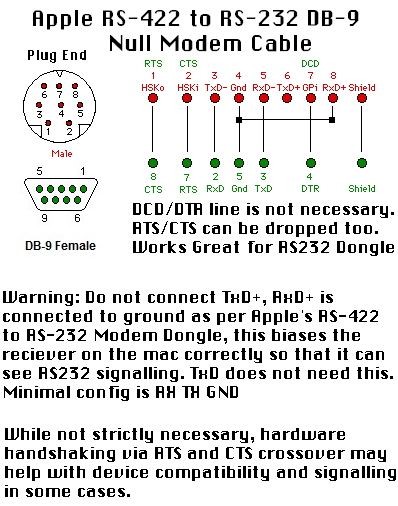

# Null Modem Cable: Mac RS-422 ↔ PC RS-232 (DB-9 F–F)

This directory documents a proven-working null modem cable for connecting a classic Mac
(Quadra-era RS-422 mini-DIN-8) to a PC RS-232 DB-9 serial port.

The goal: a reliable, repeatable wiring reference that can be reused 
without hunting through forum posts.

---

## Wiring Diagram

---

## Notes

- Mac side: RS-422 (mini-DIN-8) configured to talk to PC-style RS-232.
- PC side: DB-9 female, wired as a null modem (crossed TX/RX, with appropriate handshaking).
- Intended for:
  - Direct serial file transfer
  - Serial console / terminal access
  - General Mac ↔ PC experiments where a “real” null-modem cable is required

## Getting Online
- You'll want Open Transport, 1.3/1.3.1 is best if you can get it.
- You'll want either a SLIP or PPP client, I used Apple Remote Access Client 3 in PPP mode.
- You'll need a host device or machine that can handshake properly if you want the highest possible speed, you will need RTS CTS handhshaking enabled for that.
- Web browsing outside of action retro's frogfind is a humorous proposition at best, but that at least worked for me when tested.
- There is Macintosh Repository's 68K Client that may offer better value for your network connection.
